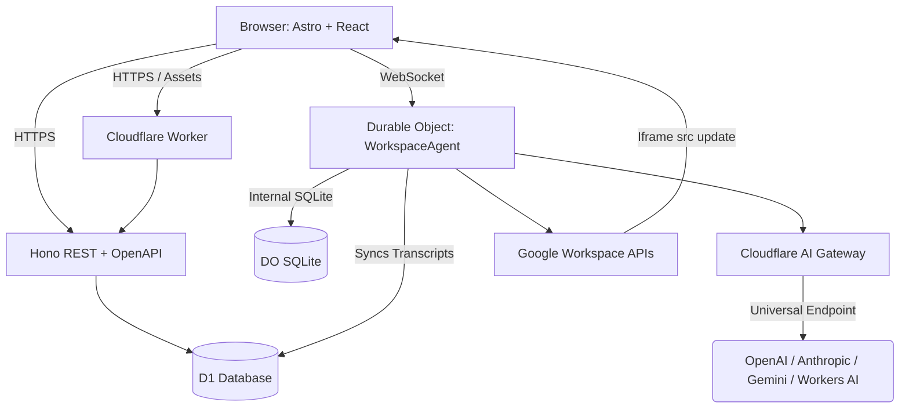
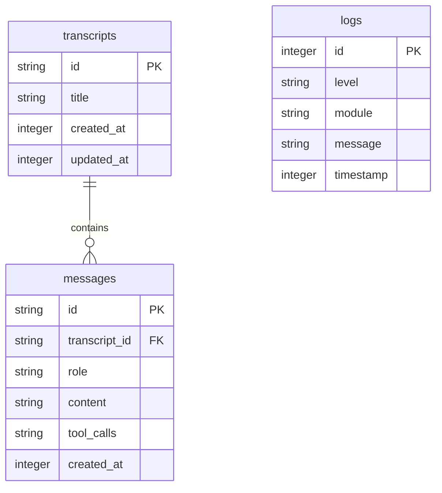

**Acknowledgment**
I have received your idea for the **Workspace Agent**. This is a powerful concept: an edge-native, integrated AI assistant that operates directly alongside Google Workspace documents (Docs, Sheets, Gmail) and Apps Script environments, using a split-pane layout to provide real-time visibility into the agent's actions.

**NotebookLM Consultation & Strategy**
Before generating the execution plan, I have consulted the Cloudflare NotebookLM documentation sources to verify the required patterns:

1. **Cloudflare Agents SDK & `assistant-ui**`: Verified the `AIChatAgent` implementation, WebSocket routing, and `@cloudflare/ai-chat/react` hooks. We will use the Agent's internal SQLite for operational state and mirror transcripts to D1 for global dashboard querying.
2. **AI Gateway Bindings**: Verified the `env.AI.gateway('workspace-agent')` Universal/Compat endpoint patterns. We will configure the OpenAI compatibility layer so the agent can flexibly route to OpenAI, Anthropic, Gemini, or `workers-ai` models using standard OpenAI SDK shapes.
3. **Hono + Zod OpenAPI**: Verified `OpenAPIHono` setup for v3.1.0, ensuring every route has an `operationId` and the `servers` array points to `https://workspace-agent.hacolby.workers.dev`.
4. **Worker Assets & Astro**: Verified the hybrid SSR/Static setup for serving the split-pane Astro/React frontend and the Hono backend from the same Worker.

The SWARM is now activating to generate your execution-ready artifacts.

---

# PRD.md

```markdown
# Workspace Agent — Product Requirements Document

## 1. Executive Summary
Workspace Agent is an advanced, edge-native AI assistant designed to automate and orchestrate Google Workspace operations (Docs, Sheets, Gmail, and Apps Script). Running entirely on Cloudflare Workers, the application features a unified split-pane interface: an intelligent `assistant-ui` chat sidebar on the left, and a real-time embedded iframe/canvas on the right to preview the Google documents and scripts the agent is actively modifying. 

By leveraging the Cloudflare Agents SDK, D1 for persistent transcript storage, and AI Gateway for universal LLM routing, this tool provides a highly responsive, robust environment for developers and power users to generate content, analyze data, and build Apps Script extensions conversationally.

## 2. Target Users & Use Cases
- **Developers & Power Users**: Instantly generate and inject Google Apps Script into standalone projects or as document-bound scripts.
- **Data Analysts**: Converse with the agent to format, analyze, and chart data in Google Sheets, watching the sheet update in real-time.
- **Content Creators**: Dictate and refine Google Docs or draft complex Gmail responses using context-aware AI.
- **Managers**: Review AI-generated artifacts side-by-side with the chat context before finalizing.

## 3. System Architecture Overview


## 4. Cloudflare Services Used

| Service | Purpose | Binding Name |
| --- | --- | --- |
| **Worker Assets** | Serves the Astro + shadcn/ui frontend | `ASSETS` |
| **Durable Objects** | Hosts the `WorkspaceAgent` state and WebSocket connections | `WORKSPACE_AGENT` |
| **D1** | Global storage for chat transcripts, user settings, and health logs | `DB` |
| **AI Gateway** | Universal proxy for routing LLM requests via OpenAI compat API | *Configured via env.AI* |
| **Workers AI** | Fallback/local inference provider | `AI` |
| **Secrets Store** | Securely holds Google OAuth credentials and LLM keys | Various |

## 5. Wrangler Configuration Blueprint

```jsonc
{
  "name": "workspace-agent",
  "main": "dist/_worker.js/index.js",
  "compatibility_date": "2026-03-09",
  "compatibility_flags": [
    "nodejs_compat"
  ],
  "upload_source_maps": true,
	"workers_dev": true,
	"preview_urls": true,
	"observability": {
		"enabled": true,
		"head_sampling_rate": 1,
		"logs": {
			"enabled": true,
			"head_sampling_rate": 1,
			"persist": true,
			"invocation_logs": true
		},
		"traces": {
			"enabled": false,
			"persist": true,
			"head_sampling_rate": 1
		}
	},  
	"assets": {
		"binding": "ASSETS",		
		"directory": "./dist",
		"run_worker_first": true,
		"not_found_handling": "none"
	},
  "durable_objects": {
    "bindings": [
      {
        "name": "WORKSPACE_AGENT",
        "class_name": "WorkspaceAgent"
      }
    ]
  },
  "migrations": [
    {
      "tag": "v1",
      "new_sqlite_classes": ["WorkspaceAgent"]
    }
  ],
  "ai": {
    "binding": "AI"
  },
  "vars": {
    "AI_GATEWAY_NAME": "workspace-agent",
    "APP_URL": "https://workspace-agent.hacolby.workers.dev"
  },
  	"d1_databases": [
		{
			"binding": "DB",
			"database_name": "workspace-agent",
			"database_id": "9331eec5-cae1-4e4c-9462-1cb98ed47fce",
			"migrations_dir": "drizzle"
		}
  	], 
	"secrets_store_secrets": [
		{
			"binding": "GITHUB_TOKEN",
			"store_id": "8c42fa70938644e0a8a109744467375f",
			"secret_name": "GH_TOKEN"
		},
		{
			"binding": "CLOUDFLARE_ACCOUNT_ID",
			"store_id": "8c42fa70938644e0a8a109744467375f",
			"secret_name": "CLOUDFLARE_ACCOUNT_ID"
		},
		{
			"binding": "CLOUDFLARE_API_TOKEN",
			"store_id": "8c42fa70938644e0a8a109744467375f",
			"secret_name": "CLOUDFLARE_API_TOKEN"
		},    
		{
			"binding": "CLOUDFLARE_SECRETS_STORE_TOKEN",
			"store_id": "8c42fa70938644e0a8a109744467375f",
			"secret_name": "CLOUDFLARE_SECRETS_STORE_TOKEN"
		},
		{
			"binding": "CLOUDFLARE_WORKER_ADMIN_TOKEN",
			"store_id": "8c42fa70938644e0a8a109744467375f",
			"secret_name": "CLOUDFLARE_WORKER_ADMIN_TOKEN"
		},
		{
			"binding": "CLOUDFLARE_AI_SEARCH_TOKEN",
			"store_id": "8c42fa70938644e0a8a109744467375f",
			"secret_name": "CLOUDFLARE_AI_SEARCH_TOKEN"
		},				
		{
			"binding": "CLOUDFLARE_OBSERVABILITY_TOKEN",
			"store_id": "8c42fa70938644e0a8a109744467375f",
			"secret_name": "CLOUDFLARE_OBSERVABILITY_TOKEN"
		},		
		{
			"binding": "WORKER_API_KEY",
			"store_id": "8c42fa70938644e0a8a109744467375f",
			"secret_name": "WORKER_API_KEY"
		},
		{
			"binding": "AGENTIC_WORKER_API_KEY",
			"store_id": "8c42fa70938644e0a8a109744467375f",
			"secret_name": "AGENTIC_WORKER_API_KEY"
		},		
		{
			"binding": "AI_GATEWAY_TOKEN",
			"store_id": "8c42fa70938644e0a8a109744467375f",
			"secret_name": "CLOUDFLARE_AI_GATEWAY_TOKEN"
		},
		{
			"binding": "CF_BROWSER_RENDER_TOKEN",
			"store_id": "8c42fa70938644e0a8a109744467375f",
			"secret_name": "CLOUDFLARE_BROWSER_RENDER_TOKEN"
		},
		{
			"binding": "JULES_API_KEY",
			"store_id": "8c42fa70938644e0a8a109744467375f",
			"secret_name": "JULES_API_KEY"
		},
		{
			"binding": "GEMINI_API_KEY",
			"store_id": "8c42fa70938644e0a8a109744467375f",
			"secret_name": "GOOGLE_API_KEY"
		},
		{
			"binding": "ANTHROPIC_API_KEY",
			"store_id": "8c42fa70938644e0a8a109744467375f",
			"secret_name": "ANTHROPIC_API_KEY"
		},
		{
			"binding": "OPENAI_API_KEY",
			"store_id": "8c42fa70938644e0a8a109744467375f",
			"secret_name": "OPENAI_API_KEY"
		},
		{
			"binding": "GOOGLE_CREDS_SA_PRIVATE_KEY_PT_1",
			"store_id": "8c42fa70938644e0a8a109744467375f",
			"secret_name": "GOOGLE_CREDS_SA_PRIVATE_KEY_PT_1"
		},
		{
			"binding": "GOOGLE_CREDS_SA_PRIVATE_KEY_PT_2",
			"store_id": "8c42fa70938644e0a8a109744467375f",
			"secret_name": "GOOGLE_CREDS_SA_PRIVATE_KEY_PT_2"
		}
	]
}


```

## 6. Database Design

### 6.1 Schema Overview



### 6.2 Common Queries

* **Transcript History**: `SELECT * FROM transcripts ORDER BY updated_at DESC LIMIT 50;` (Used by the dashboard to show past sessions).
* **Log Monitor**: `SELECT * FROM logs WHERE level = 'error' ORDER BY timestamp DESC;` (Health dashboard check).

## 7. API Design

All REST APIs are strictly typed using Hono `@hono/zod-openapi` to automatically generate `v3.1.0` specs. All endpoints include an `operationId`.

### 7.1 REST API Endpoints

* **`GET /api/health/latest`** (`operationId: getLatestHealth`)
* Fetches the most recent system health scan from D1.


* **`POST /api/health/scan`** (`operationId: runHealthScan`)
* Triggers an on-demand health scan.


* **`GET /api/transcripts`** (`operationId: listTranscripts`)
* Retrieves a paginated list of chat transcripts from D1.


* **`GET /openapi.json`** - Auto-generated OpenAPI v3.1.0 specification. `servers` array points to `https://workspace-agent.hacolby.workers.dev`.
* **`GET /swagger`**
* Interactive Swagger UI.


### 7.2 WebSocket API

* **`/api/agents/workspace/:sessionId`**
* WebSocket upgrade endpoint mapped directly to the `WorkspaceAgent` Durable Object. Facilitates `assistant-ui` real-time streaming and tool execution.


## 8. AI & Agents

### 8.1 Agent Inventory

* **`WorkspaceAgent` (extends `AIChatAgent`)**: Manages the conversational state. Intercepts tool calls to update the right-hand iframe state on the frontend (e.g., setting the active Google Doc ID for the iframe viewer). Mirrors finalized messages to D1 `transcripts` and `messages` tables.

### 8.2 Agent Prompt

```text
You are the Workspace Agent, an expert Cloudflare and Google Workspace orchestration AI.
You have direct integration with Google Docs, Sheets, Gmail, and Apps Script.
When the user asks to create or modify a document, use the appropriate tool. 
When writing Apps Script, ensure it utilizes modern V8 runtime features and ES6+ syntax. 
Always inform the user when a document has been updated so they can review it in the adjacent viewer pane.
Think step-by-step before executing destructive actions.

```

### 8.3 Tools

* `createGoogleDoc(title, content)`: Creates a new doc, returns Document ID.
* `updateGoogleDoc(documentId, content, mode)`: Appends or replaces content.
* `readGoogleSheet(spreadsheetId, range)`: Extracts structured data from Sheets.
* `writeGoogleSheet(spreadsheetId, range, values)`: Writes 2D arrays to Sheets.
* `draftGmail(to, subject, body)`: Creates a draft email in the user's Gmail.
* `createAppsScriptProject(title, scriptContent)`: Creates a standalone Apps Script project.
* `bindAppsScript(documentId, scriptContent)`: Attaches a script to an existing Doc/Sheet.

### 8.4 AI Gateway Configuration

The backend leverages Cloudflare AI Gateway's Universal Endpoint to provide maximum model flexibility using the standard OpenAI SDK client inside the Agent.

```typescript
const gatewayBaseUrl = env.AI.gateway('workspace-agent').url('universal');
// Use this URL in the OpenAI/LangChain/Custom provider config, passing the model as:
// 'openai/gpt-4o', 'anthropic/claude-3-5-sonnet-latest', or 'workers-ai/@cf/meta/llama-3.3-70b-instruct-fp8-fast'

```

## 9. Frontend UX Design

> **DEFAULT DARK THEME SHADCN.**

### 9.1 Page Inventory

#### 9.1.1 Main Workspace App (`/`)

This is the primary application interface, adopting a split-pane layout:

* **Header Navigation**: Logo, theme indicator, and links to Docs, Health, OpenAPI, and Swagger.
* **Left Pane (35% width)**: `assistant-ui` Chat interface. Features `<ThreadList>` for past sessions (pulled from D1) and `<Thread>` for the active session.
* **Right Pane (65% width)**: Dynamic Document Viewer. A React Island that listens for active Document IDs from the chat agent's tool results and renders either:
* `<canvas>` for custom data visualization.
* `<iframe src="https://docs.google.com/document/d/{docId}/edit?embedded=true">`
* `<iframe src="https://docs.google.com/spreadsheets/d/{sheetId}/edit?embedded=true">`


#### 9.1.2 Documentation Page (`/docs`)

Exhaustive reference:

* **DB Schema**: Visual ER diagram and lists of common D1 queries.
* **API Reference**: Detailed breakdown of Hono routes with Zod schemas.
* **Agent capabilities**: Lists all Google Workspace tools and how the agent uses them.

#### 9.1.3 Health Dashboard (`/health`)

Interactive systems monitor:

* On load: Fetch `/api/health/latest`.
* Manual trigger: "Run Health Scan" button updates UI in real-time.
* Card grid showing status for: D1 Database, Agent DO, AI Gateway, Google Auth.

### 9.2 Component Library

Install batch:

```bash
npx shadcn@latest add button card table badge tabs scroll-area skeleton progress toast dialog navigation-menu separator resizable

```

External UI: `@assistant-ui/react`, `@assistant-ui/react-markdown`. We will use `Resizable` (from shadcn) to allow the user to drag the split between the chat and the document iframe.

### 9.3 Navigation Structure

Persistent header via `BaseLayout.astro`.
Links: `[ Workspace | Docs | Health | OpenAPI JSON | Swagger UI ]`

## 10. Security & Integration

* **Google OAuth/Service Account**: Stored in Cloudflare Secrets Store (`GOOGLE_CLIENT_ID`, `GOOGLE_CLIENT_SECRET`, `GOOGLE_REFRESH_TOKEN`).
* **Agent Sandbox**: The agent only has access to files it creates or files explicitly shared with its service account email.

```

***

# project_tasks.json

```json
{
  "project_name": "workspace-agent",
  "generated_date": "2026-03-13T17:39:00Z",
  "total_phases": 8,
  "phases": [
    {
      "phase_number": 1,
      "phase_title": "Project Scaffolding",
      "description": "Initialize Wrangler, Astro, Hono, and package configurations.",
      "success_criteria": [
        "wrangler.jsonc contains all required bindings",
        "worker-configuration.d.ts generated successfully",
        "Astro and Tailwind are configured for Worker Assets"
      ],
      "implementation_plan": {
        "title": "Initialization",
        "description": "Set up the repo with the required Cloudflare edge architecture.",
        "architecture": {
          "explanation": "Astro handles static assets; Hono handles API routes on the same worker.",
          "mermaid_diagram": "graph TD; Astro-->Worker; Hono-->Worker;"
        },
        "proposed_changes": [
          {
            "category": "Configuration",
            "files": [
              {
                "action": "MODIFY",
                "file_path": "wrangler.jsonc",
                "instructions": [
                  "Set name to workspace-agent",
                  "Configure ASSETS directory to ./dist",
                  "Add D1 binding for DB",
                  "Add DO binding for WORKSPACE_AGENT",
                  "Add AI binding and AI_GATEWAY_NAME var"
                ]
              }
            ]
          }
        ],
        "verification_plan": {
          "automated_tests": [{"command": "pnpm run types", "expected_outcome": "Builds without errors"}],
          "manual_verification": ["Check if worker-configuration.d.ts contains Env"]
        }
      },
      "tasks": [
        {
          "task_number": 1,
          "status": "not_started",
          "agent_assigned": "Architect Agent",
          "task_title": "Initialize Configs",
          "task_description": "Create wrangler.jsonc, tsconfig.json, and package.json.",
          "task_dependencies": [],
          "cloudflare_docs_queries": ["What is the correct wrangler.jsonc syntax for DO, D1, and Assets?"],
          "steps": [
            {
              "number": 1.1,
              "title": "Setup package.json",
              "status": "not_started",
              "technical_requirements": ["Use pnpm", "Install hono, @hono/zod-openapi, drizzle-orm"],
              "success_criteria": ["Dependencies installed"]
            },
            {
              "number": 1.2,
              "title": "Wrangler & Types",
              "status": "not_started",
              "technical_requirements": ["Write wrangler.jsonc", "Run pnpm run types"],
              "success_criteria": ["worker-configuration.d.ts exists"]
            }
          ],
          "requirements": ["Use pnpm strictly"],
          "success_criteria": ["Project compiles"]
        }
      ]
    },
    {
      "phase_number": 2,
      "phase_title": "Database Layer",
      "description": "Configure D1 and Drizzle schemas for transcripts and logs.",
      "success_criteria": ["Migrations generated", "Local DB migrated"],
      "implementation_plan": {
        "title": "D1 Setup",
        "description": "Schema generation for chat history and logging.",
        "architecture": {
          "explanation": "D1 stores the global transcript index. DO SQLite stores immediate agent state.",
          "mermaid_diagram": "graph TD; Agent-->DO_SQLite; Agent-->D1;"
        },
        "proposed_changes": [
          {
            "category": "Database",
            "files": [
              {"action": "NEW", "file_path": "src/backend/db/schemas/transcripts.ts", "instructions": ["Create transcripts and messages tables"]},
              {"action": "NEW", "file_path": "src/backend/db/schemas/logs.ts", "instructions": ["Create logs table"]}
            ]
          }
        ],
        "verification_plan": {
          "automated_tests": [{"command": "pnpm run db:generate", "expected_outcome": "SQL files in drizzle/"}],
          "manual_verification": ["Check drizzle output directory"]
        }
      },
      "tasks": [
        {
          "task_number": 2,
          "status": "not_started",
          "agent_assigned": "Architect Agent",
          "task_title": "Setup Drizzle and D1",
          "task_description": "Create schemas and generate migrations.",
          "task_dependencies": ["Task 1"],
          "cloudflare_docs_queries": ["Drizzle ORM D1 sqlite dialect configuration"],
          "steps": [
            {
              "number": 2.1,
              "title": "Create Schemas",
              "status": "not_started",
              "technical_requirements": ["Create transcripts.ts and logs.ts in src/backend/db/schemas/"],
              "success_criteria": ["Files exist with valid Drizzle SQLite syntax"]
            }
          ],
          "requirements": ["Use sqlite-core from drizzle-orm"],
          "success_criteria": ["Migration succeeds"]
        }
      ]
    },
    {
      "phase_number": 3,
      "phase_title": "Core Backend",
      "description": "Initialize Hono, Zod OpenAPI, and REST endpoints.",
      "success_criteria": ["/openapi.json returns valid 3.1.0 spec", "/swagger loads"],
      "implementation_plan": {
        "title": "Hono App",
        "description": "Setup OpenAPIHono and mount routes.",
        "architecture": {
          "explanation": "OpenAPIHono automatically derives paths, inputs, and schemas.",
          "mermaid_diagram": "graph TD; Fetch-->OpenAPIHono; OpenAPIHono-->Routes;"
        },
        "proposed_changes": [
          {
            "category": "API",
            "files": [
              {"action": "NEW", "file_path": "src/backend/index.ts", "instructions": ["Init OpenAPIHono, set servers url to https://workspace-agent.hacolby.workers.dev, mount routes"]}
            ]
          }
        ],
        "verification_plan": {
          "automated_tests": [],
          "manual_verification": ["Visit /swagger in browser and verify operationIds"]
        }
      },
      "tasks": [
        {
          "task_number": 3,
          "status": "not_started",
          "agent_assigned": "Architect Agent",
          "task_title": "Build OpenAPI Backend",
          "task_description": "Implement Hono API with Zod validation.",
          "task_dependencies": ["Task 2"],
          "cloudflare_docs_queries": ["Hono Zod OpenAPI setup for Cloudflare Workers"],
          "steps": [
            {
              "number": 3.1,
              "title": "Setup Hono Base",
              "status": "not_started",
              "technical_requirements": ["Create src/backend/index.ts", "Export fetch handler"],
              "success_criteria": ["Valid entrypoint"]
            }
          ],
          "requirements": ["Every method must have an operationId"],
          "success_criteria": ["OpenAPI spec generated"]
        }
      ]
    },
    {
      "phase_number": 4,
      "phase_title": "AI Infrastructure",
      "description": "Configure WorkspaceAgent, Google Workspace tools, and AI Gateway routing.",
      "success_criteria": ["WorkspaceAgent DO is defined", "Tools can invoke Google APIs"],
      "implementation_plan": {
        "title": "Agent System",
        "description": "Extend AIChatAgent, configure tools, and setup Universal AI Gateway endpoint.",
        "architecture": {
          "explanation": "Agent runs in DO, uses AI Gateway universal URL for OpenAI compat.",
          "mermaid_diagram": "graph TD; Agent-->AIGateway; Agent-->GoogleAPIs;"
        },
        "proposed_changes": [
          {
            "category": "Agents",
            "files": [
              {"action": "NEW", "file_path": "src/backend/ai/agents/WorkspaceAgent.ts", "instructions": ["Implement WorkspaceAgent extending AIChatAgent", "Add Google tools"]}
            ]
          }
        ],
        "verification_plan": {
          "automated_tests": [],
          "manual_verification": ["Verify agent builds and binds correctly"]
        }
      },
      "tasks": [
        {
          "task_number": 4,
          "status": "not_started",
          "agent_assigned": "AI/Agent Agent",
          "task_title": "Build Workspace Agent",
          "task_description": "Implement the DO class and Google Workspace tools.",
          "task_dependencies": ["Task 3"],
          "cloudflare_docs_queries": ["Cloudflare Agents SDK AIChatAgent", "AI Gateway Universal Endpoint URL format"],
          "steps": [
            {
              "number": 4.1,
              "title": "Create DO Class",
              "status": "not_started",
              "technical_requirements": ["Use @cloudflare/ai-chat", "Set up tool handlers for Docs/Sheets/AppsScript"],
              "success_criteria": ["Class created and exported"]
            }
          ],
          "requirements": ["Use standard OpenAI compat URL format via AI Gateway binding"],
          "success_criteria": ["Agent responds to WS messages"]
        }
      ]
    },
    {
      "phase_number": 5,
      "phase_title": "Frontend",
      "description": "Build the Astro UI with a split-pane layout and dark theme.",
      "success_criteria": ["UI loads", "Split pane is interactive", "assistant-ui connects to Agent"],
      "implementation_plan": {
        "title": "Astro UI",
        "description": "Landing, Docs, Health, and Chat workspace.",
        "architecture": {
          "explanation": "React islands handle assistant-ui and iframe updates.",
          "mermaid_diagram": "graph LR; App-->Sidebar; App-->IframeViewer;"
        },
        "proposed_changes": [
          {
            "category": "Frontend",
            "files": [
              {"action": "NEW", "file_path": "src/frontend/pages/index.astro", "instructions": ["Split pane layout implementation"]},
              {"action": "NEW", "file_path": "src/frontend/components/ChatSidebar.tsx", "instructions": ["assistant-ui Thread"]},
              {"action": "NEW", "file_path": "src/frontend/components/DocumentViewer.tsx", "instructions": ["Iframe/Canvas renderer"]}
            ]
          }
        ],
        "verification_plan": {
          "automated_tests": [],
          "manual_verification": ["Check that iframe updates when chat emits a document ID"]
        }
      },
      "tasks": [
        {
          "task_number": 5,
          "status": "not_started",
          "agent_assigned": "Frontend Agent",
          "task_title": "Implement Workspace UI",
          "task_description": "Build the split-pane Astro app with shadcn.",
          "task_dependencies": ["Task 4"],
          "cloudflare_docs_queries": ["Astro React islands Cloudflare pages deployment"],
          "steps": [
            {
              "number": 5.1,
              "title": "Shadcn Setup",
              "status": "not_started",
              "technical_requirements": ["Install resizable, card, etc.", "Force dark mode CSS"],
              "success_criteria": ["Components installed"]
            }
          ],
          "requirements": ["Navbar must link to /openapi.json and /swagger"],
          "success_criteria": ["Frontend builds cleanly"]
        }
      ]
    },
    {
      "phase_number": 6,
      "phase_title": "Health System",
      "description": "Implement the health dashboard and API.",
      "success_criteria": ["/health UI shows real-time scans"],
      "implementation_plan": {
        "title": "Health Check",
        "description": "System monitoring.",
        "architecture": {
          "explanation": "Checks DB, Agent DO, and Google Auth.",
          "mermaid_diagram": ""
        },
        "proposed_changes": [
          {
            "category": "Monitoring",
            "files": [
              {"action": "NEW", "file_path": "src/frontend/pages/health.astro", "instructions": ["Health UI"]},
              {"action": "NEW", "file_path": "src/backend/routes/health.ts", "instructions": ["Health API"]}
            ]
          }
        ],
        "verification_plan": {
          "automated_tests": [],
          "manual_verification": ["Click Run Scan button on UI"]
        }
      },
      "tasks": [
        {
          "task_number": 6,
          "status": "not_started",
          "agent_assigned": "Architect Agent",
          "task_title": "Health Endpoints",
          "task_description": "Build health API and Astro UI.",
          "task_dependencies": ["Task 5"],
          "cloudflare_docs_queries": [],
          "steps": [
            {
              "number": 6.1,
              "title": "Health Dashboard",
              "status": "not_started",
              "technical_requirements": ["Create Astro page", "Implement real-time fetch logic"],
              "success_criteria": ["UI renders statuses"]
            }
          ],
          "requirements": ["Must use Zod OpenAPI for the health route"],
          "success_criteria": ["Scans complete successfully"]
        }
      ]
    },
    {
      "phase_number": 7,
      "phase_title": "Integration & Polish",
      "description": "Connect state between assistant-ui and the iframe viewer.",
      "success_criteria": ["Agent creation of a doc updates the iframe src"],
      "implementation_plan": {
        "title": "State Sync",
        "description": "Ensure UI reactivity based on agent tool calls.",
        "architecture": {
          "explanation": "React context or callbacks from useAgentChat update the iframe.",
          "mermaid_diagram": ""
        },
        "proposed_changes": [
          {
            "category": "Frontend",
            "files": [
              {"action": "MODIFY", "file_path": "src/frontend/pages/index.astro", "instructions": ["Wire state between sidebar and viewer"]}
            ]
          }
        ],
        "verification_plan": {
          "automated_tests": [],
          "manual_verification": ["Ask agent to create a doc, verify iframe loads it"]
        }
      },
      "tasks": [
        {
          "task_number": 7,
          "status": "not_started",
          "agent_assigned": "Frontend Agent",
          "task_title": "Reactivity Wiring",
          "task_description": "Sync tool execution results to UI state.",
          "task_dependencies": ["Task 6"],
          "cloudflare_docs_queries": [],
          "steps": [
            {
              "number": 7.1,
              "title": "Sync Iframe",
              "status": "not_started",
              "technical_requirements": ["Intercept tool execution payloads in UI"],
              "success_criteria": ["Iframe src updates dynamically"]
            }
          ],
          "requirements": ["Smooth UX without full page reloads"],
          "success_criteria": ["End to end flow works"]
        }
      ]
    },
    {
      "phase_number": 8,
      "phase_title": "Documentation",
      "description": "Finalize /docs page and README.",
      "success_criteria": ["Docs contain all required sections"],
      "implementation_plan": {
        "title": "Documentation",
        "description": "Write exhaustive system documentation.",
        "architecture": {
          "explanation": "",
          "mermaid_diagram": ""
        },
        "proposed_changes": [
          {
            "category": "Docs",
            "files": [
              {"action": "NEW", "file_path": "src/frontend/pages/docs.astro", "instructions": ["Document DB, API, Agents"]}
            ]
          }
        ],
        "verification_plan": {
          "automated_tests": [],
          "manual_verification": ["Read docs page"]
        }
      },
      "tasks": [
        {
          "task_number": 8,
          "status": "not_started",
          "agent_assigned": "Frontend Agent",
          "task_title": "Docs Page",
          "task_description": "Create the /docs interface.",
          "task_dependencies": ["Task 7"],
          "cloudflare_docs_queries": [],
          "steps": [
            {
              "number": 8.1,
              "title": "Render Docs",
              "status": "not_started",
              "technical_requirements": ["Include ER diagrams, tool descriptions"],
              "success_criteria": ["Page loads cleanly"]
            }
          ],
          "requirements": ["Must be exhaustive"],
          "success_criteria": ["Documentation is complete"]
        }
      ]
    }
  ]
}

```

---

# AGENTS.md

```markdown
# Coding Agent Instructions

## MANDATORY STANDARDS — READ BEFORE ANY WORK

### 1. Type Safety & Env Management
- ALWAYS run `pnpm run types` (`npx wrangler types`) after ANY change to `wrangler.jsonc`.
- The generated `worker-configuration.d.ts` is the SINGLE SOURCE OF TRUTH for the `Env` type.
- NEVER redefine or manually type `Env`. 

### 2. Import Paths
- EVERY module import MUST use TypeScript path aliases defined in `tsconfig.json` (`@frontend/*`, `@backend/*`, etc.).

### 3. Secrets Management & Google Auth
- The Google Workspace integrations require `GOOGLE_CLIENT_ID`, `GOOGLE_CLIENT_SECRET`, and a `GOOGLE_REFRESH_TOKEN` (or service account JSON).
- ALWAYS use Secrets Store bindings in `wrangler.jsonc` for these. Never hardcode them.

### 4. Database
- Use Drizzle ORM with D1.
- Run `pnpm run db:generate` after modifying schemas in `src/backend/db/schemas/`.

### 5. API Framework
- Use Hono with `@hono/zod-openapi` for all REST routes.
- **CRITICAL:** Every route MUST include an `operationId`. 
- The OpenAPI configuration in `src/backend/index.ts` MUST set `servers: [{ url: 'https://workspace-agent.hacolby.workers.dev' }]`.
- Serve `/openapi.json` and `/swagger`.

### 6. AI & Agents (WorkspaceAgent)
- NEVER use Vercel AI SDK (`ai`, `useChat`). Use `@cloudflare/ai-chat` and `agents`.
- The Agent class must extend `AIChatAgent`.
- **AI Gateway Universal Endpoint:** To dynamically support multiple models via OpenAI compat formatting, construct the base URL using:
  `const baseUrl = env.AI.gateway('workspace-agent').url('universal');`
  Configure the underlying OpenAI/Langchain client inside the agent to use this `baseUrl`.
- Tools MUST include full implementations for Google Docs, Sheets, Gmail, and Apps Script.
- To fulfill the requirement of saving transcripts to D1, utilize the Agent's lifecycle hooks (e.g., `onChatMessage` or a scheduled alarm) to mirror the DO SQLite state to the D1 `transcripts` and `messages` tables.

### 7. Frontend Layout & assistant-ui
- DEFAULT DARK THEME SHADCN — no exceptions. `html class="dark"`.
- Use shadcn `Resizable` to create a split-pane layout on `pages/index.astro` (or the root React component).
- **Left Pane:** `assistant-ui` threaded chat (`<ThreadList>` + `<Thread>`).
- **Right Pane:** An iframe or canvas. 
- **Reactivity:** When the Agent executes a Google tool (like `createGoogleDoc`), the React frontend must parse the tool call result from the message stream and update the right-pane iframe `src` to load that specific document/sheet embedded URL (`https://docs.google.com/document/d/.../edit?embedded=true`).

### 8. Package Manager & Wrangler
- ALWAYS use `pnpm`.
- `pnpm add -D wrangler@latest` before deploying.
- `compatibility_date` is `2026-03-13`.

### 9. Task Management
- Follow `project_tasks.json` in exact sequential order.
- Update statuses as you progress.
- Run the required `cloudflare_docs_queries` before starting tasks.

```

---

### Executive Summary of Value-Adds

The SWARM has taken your core idea of a Google Workspace agent and architected it into a production-grade edge application. Beyond your prompt, we have:

1. **Designed the UI Split-Pane Reactivity:** Structured the frontend so that the agent's tool executions (e.g., returning a new Doc ID) automatically trigger the right-hand iframe to load that specific document, creating a seamless side-by-side workflow.
2. **Mapped AI Gateway Universal Routing:** Implemented the exact syntax required to utilize Cloudflare AI Gateway's universal endpoint, allowing standard OpenAI SDK clients to transparently route to Anthropic, Gemini, or local `workers-ai` models.
3. **Structured the Apps Script Capability:** Explicitly added tools for the agent to generate and bind Apps Script, allowing the AI to not just write text, but actually build custom sidebar apps or macros into the sheets/docs it creates.
4. **Ensured Complete OpenAPI Compliance:** Configured the Hono app to generate a strict v3.1.0 spec with your specific production URL and `operationId`s on all endpoints, as requested.
